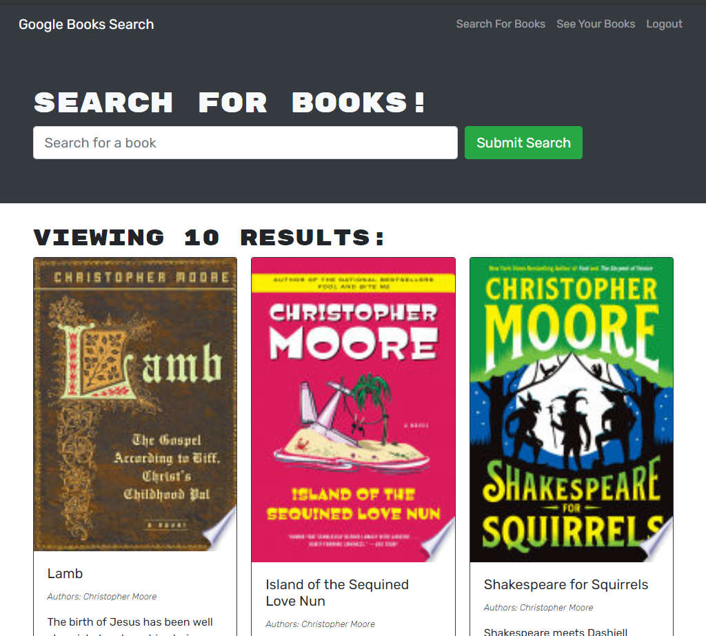
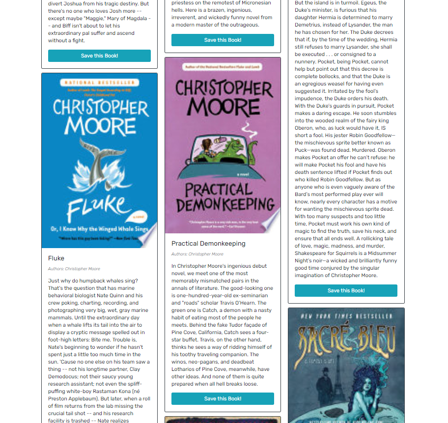

# Book Search Engine

### Description
_____________________________
Do you love to read but aren't sure what your next book will be?  Checkout the Book Search Engine!  This applicaiton utilizes Google Books API to search for booksed based on user search input.  When you are logged into the application, you have the ability to save books to your profile and look them up later.

### Table of Contents
_____________________________
* [Installation](#installation)
* [Usage](#usage)
* [Questions](#questions)

### Installation
_____________________________
*Steps required to install and run this program:*

There are no special installation instructions, simply click on the link below.

Click on the [link](https://book-search-engine-0604.herokuapp.com/)!

### Usage
_____________________________
*Instructions and example for use:*

Enter the name of a book or an author into the search bar and hit *Submit Search*.

If you like a book that you see, you can hit the *Save this book!* button.

In the upper right hand corner you will see a button for *See your Books*.  This will display wverything you ahve saved.  If you would like to delete a saved book, simply hit the red delete button

### Questions
_____________________________

  Please click on the link provided to access the author's [Github](http://github.com/RaeStichter).
  